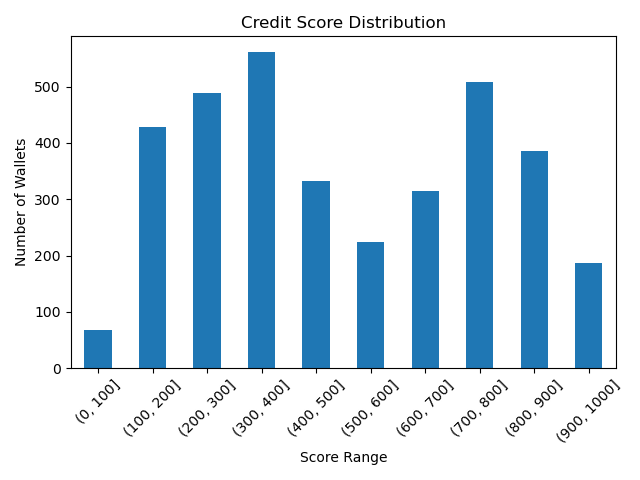

# Wallet Credit Score Analysis

## Score Distribution

## Score Range Interpretation

### 0–100 (Very Low Scores)
- Minimal wallet activity.
- Low amounts and few actions logged.

### 100–400 (Low to Moderate Scores)
- Modest usage with a small number of deposits or borrows.
- Rarely diversified across actions (e.g., no repayments).
- Some may show warning signs like early liquidations or inconsistent behavior.

### 400–800 (Moderate to Good Scores)
- Most wallets fall in this band.
- Mixed behavior with responsible usage.
- These users interacted consistently and showed repayment patterns.

### 800–1000 (High Scores)
- Power users with frequent transactions and high volumes.
- Actions include deposits, repayments, and low risk signs (e.g., no liquidation).
- Tend to diversify asset usage and contribute positively to the protocol.

---

## Observations
- The majority of wallets cluster between 200–800.
- A small percentage score above 900, with these likely representing top-tier DeFi participants.
- Wallets under 100 are rare but often indicate exploitative or negligible interaction.

---

## Summary
This scoring model effectively captures responsible vs risky behavior on the Aave V2 protocol, using just transactional metadata. This can be extended by incorporating time-based activity, asset diversity, and liquidation trends.